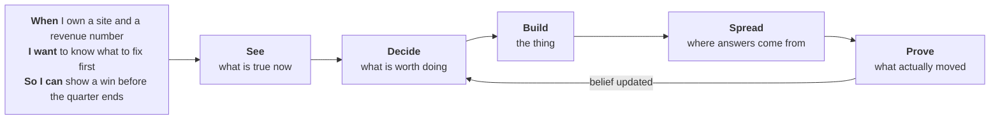
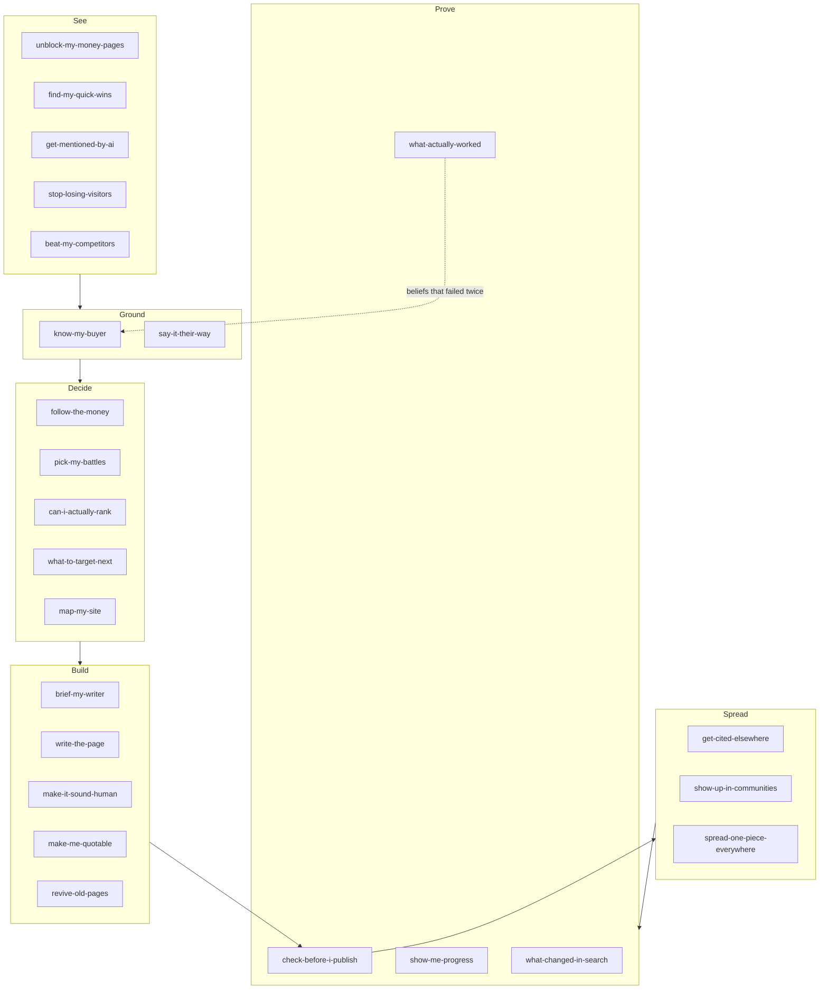
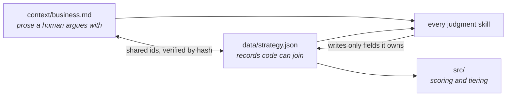

# Rainmaker

An open-source GTM search system with one principle:

> Every finding is ranked by distance to revenue, never by technical severity.

Most SEO tooling reports 200 issues sorted by a severity score its own vendor invented. Rainmaker sorts by whether fixing the thing can plausibly produce a customer, tells you the three closest to revenue, and then keeps a permanent record of whether the fix worked. The record is the point. A plan goes stale in a quarter; a system that remembers what it believed, what it shipped and what moved does not.

Works with no credentials, no account and no model on the first run. Bring your own keys to unlock more.

```bash
npx rainmaker init      # eight questions, ninety seconds
npx rainmaker audit     # crawls, tiers, scores, writes JSON and Markdown
```

## The job to be done



The arrow back from Prove to Decide is the whole product. Everything else in this category stops at Build.

## Revenue tiers

Every URL gets a tier, and the tier drives every score.

| Tier | What lives there | Weight |
|---|---|---|
| 0 | Money changes hands: pricing, demo, signup, checkout, contact | 5.0 |
| 1 | Decision: comparisons, alternatives, case studies, integrations | 3.0 |
| 2 | Solution: pain-point content, use cases | 2.0 |
| 3 | Problem: awareness, educational | 1.0 |
| 4 | Ambient: brand, about, careers | 0.3 |

Tiers are assigned by eight precedence rules in code, in strict order, each recording which rule fired and how confident it is. No model produces or adjusts a score. Two runs over unchanged input produce identical numbers.

## The pipeline



26 skills, six phases, one decision each. No two skills can answer the same question, and together they cover the whole job.

## The context layer

Every skill loads the same business context, so the system holds one opinion rather than 26.



`business.md` holds the buyer's own words, the proof, the competitors and the things you refuse to claim. `strategy.json` holds the same commitments as addressable records. They share ids, they are verified against each other by hash, and each field has exactly one skill allowed to write it.

## What makes ranking durable

Three mechanisms most systems skip, because each one tells you to do less.

- **SERP verdicts.** Nothing gets briefed without reading the live SERP first. Every candidate ends QUALIFY, CONDITIONAL or KILL, and beatability requires named evidence rather than optimism.
- **Authority budget.** Your monthly publish rate is bounded by how many new pages your site has actually got indexed and ranked in the last 90 days. Publishing 200 pages into a site that gets 6 indexed produces 194 pages of crawl waste.
- **Topical completeness.** No fourth cluster opens while any existing cluster sits under 40 percent covered. Three half-covered clusters beat nothing; six quarter-covered clusters beat nothing at all.

## Setting it up

```bash
npx rainmaker init                     # the core, plain Node, no model needed
npx skills add vcxcvii/rainmaker       # the 26 skills, into any assistant
npx rainmaker agent                    # the interactive agent, bring your own key
```

The first ten minutes, in order:

```
$ npx rainmaker init

  Site? https://example.com
  How does the business make money? [self-serve / sales-led / plg / local-services /
    ecommerce / marketplace / media / consulting] sales-led
  Where does money change hands? /demo, /pricing, /contact
  Secondary value? /case-studies, /integrations
  Average contract value? (0 if unknown) 18000
  Days from first touch to closed won? 45
  One line on who buys: ops leads at 200-2000 person logistics firms
  Competitors? (up to 5, skip to discover them) skip

  Config written. Starting the crawl now, in the background.
  While that runs: you have no Google credentials set, so opportunity
  sizing will fall back to a flat value and every finding will say so.
  Two minutes of setup unlocks it. Run `rainmaker keys` for the steps.

  [crawl] 214 URLs discovered, 214 fetched, 0 budget exhausted
  [audit] tiering 214 URLs ... 61 findings ... scoring ... done

$ npx rainmaker agent

  I looked at 214 pages before asking you anything.

  78% of your pages are Tier 3. 4% are Tier 1. Your only comparison page
  has no internal links pointing at it from anywhere in the site.
  Your top competitor has 31 Tier 1 pages. You have 3.

  First question. Your /demo page gets 1,240 impressions and 11 clicks
  over 28 days, sitting at position 8.4. Who reads that page before a
  deal closes, and what do they still not know when they leave it?
```

The interview never runs first. It runs second, grounded in findings, because twelve questions asked about a site nobody has looked at are the same twelve questions every consultant asks. Skip it if you are in a hurry and the system stamps every downstream output `confidence: stub` until you come back.

Then three fixes, plotted on effort against impact, each with its evidence and the exact next command. Not sixty. Then it asks how often you want it to run, and recommends a cadence from your site's shape rather than assuming one.

## Why this and not a folder of SEO skills

There are good individual skills in the wild, and this project studied several closely: [Sam Dunning's SEO research pipeline](https://github.com/swan-gtm/gtm-skills/tree/main/skills/sam-dunning) is the sharpest public example of qualifying and killing keyword candidates, and [Yahav Fuchs' AEO set](https://github.com/swan-gtm/gtm-skills/tree/main/skills/yahav-fuchs) is right about decomposing AI visibility scores instead of trusting an aggregate. Both are worth reading, and Rainmaker takes the lessons.

The difference is structural, not a feature list.

| | A folder of skills | Rainmaker |
|---|---|---|
| Context | each skill re-derives the business from whatever it reads | one context layer, loaded identically, with field ownership |
| Numbers | the model produces the score | scores are computed in code and are byte-identical across runs |
| Memory | the session | append-only ledger, strategy history, verification windows |
| Scope | keyword research, or AEO, or technical | one system across your site, Google, answer engines and off-site |
| Structure | a list of pages to write | a site blueprint with one intent per URL and a publish budget |
| Ending | a plan | a record of what shipped, what moved, and what did nothing |

The last row is the one that matters. Anything can produce a plan. Very little will tell you, ninety days later, that four of the eleven things it recommended did nothing measurable, and then change its own mind about the strategy because of it.

## Example prompts

Rainmaker is meant to work whether you are one person with a blog or a team with forty thousand URLs.

**A personal site or small blog**

- "My site has about 30 pages and 200 clicks a month. What is actually worth fixing?"
- "Which of my posts are dying, and should I refresh them or delete them?"
- "I write about two unrelated topics. Am I splitting my own authority?"
- "Do any AI assistants mention me when someone asks about my field?"

**A local or service business**

- "I serve six suburbs. Should each one get its own page, or is that spam?"
- "Map out the site structure for my services across the areas I cover."
- "Which of my service pages could realistically reach the top three, and which am I wasting effort on?"

**Ecommerce**

- "My category pages cannibalise each other. Show me which ones and which to keep."
- "Which product pages get impressions but no clicks, and is that a title problem or a ranking problem?"

**B2B SaaS, mid-size**

- "We have 400 blog posts and three comparison pages. Rebalance us."
- "Our competitor owns the alternatives queries. Can we take them, honestly?"
- "Which pages does sales actually send, and are any of them technically broken?"
- "Write the brief for a comparison page, but only if the SERP says we can win it."

**A large site, thousands of URLs, several teams**

- "Rank every tier 0 and tier 1 page by revenue score and give me the top twenty with owners."
- "How many pages can we publish a month before we exceed what this site gets indexed?"
- "Show me every cluster under 40 percent complete before anyone opens a new one."
- "Traffic dropped 18 percent. Was that the core update, something we shipped, or neither? Show me the control."
- "Of everything we shipped last quarter, what did nothing?"

The last one is the question this system was built to answer, and the one most reporting is designed to avoid.

Keys are read from your environment, used against the API they belong to, and sent nowhere else. `rainmaker keys` prints what is set and exactly what each one unlocks. Everything degrades: with zero keys you still get a full technical, structural and competitor diagnosis, and every report states in a mandatory section which capabilities were live and what that weakens.

## What it will not do

- Post to any community, send outreach, change live content, or delete a URL. It drafts and files issues. A person approves.
- Let a model compute or adjust a revenue score.
- Use vendor authority metrics anywhere in scoring.
- Buy links, exchange links, simulate independent voices, or ship doorway-page permutations.
- Assert that an algorithm update caused a metric change. It reports timing consistency and shows the control.

## Specification

The full spec is in the repo and is the authority for contributors and coding agents alike.

| File | Covers |
|---|---|
| `SPEC.md` | invariants, CLI, build order |
| `spec/context-layer.md` | business context, strategy schema, field ownership |
| `spec/site-blueprint.md` | site architecture, permutation guard, authority budget |
| `spec/offsite.md` | citation graph, communities, entity consistency |
| `spec/skills.md` | all 26 skills |
| `spec/agent.md` | packaging, first run, cadence, autonomy limits |
| `spec/false-positives.md` | the evidence bar for every check, and the target under one percent |
| `spec/handoff-v1.md` | the original handoff, superseded but retained |

MIT. Built in the open by [Varun Choraria](https://varunchoraria.com).
