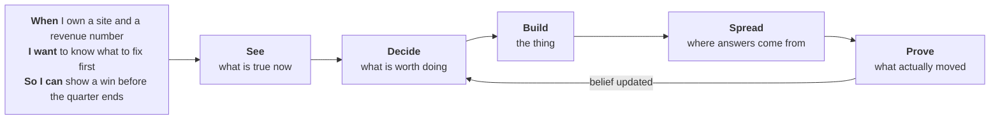
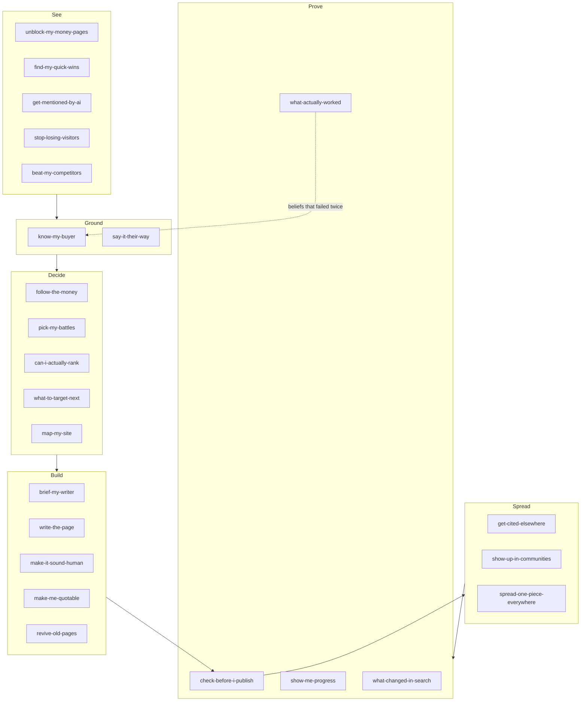
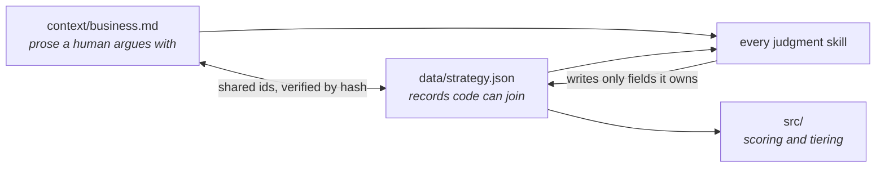

# Rainmaker

An open-source GTM search system with one principle:

> Every finding is ranked by distance to revenue, never by technical severity.

Most SEO tooling reports 200 issues sorted by a severity score its own vendor invented. Rainmaker sorts by whether fixing the thing can plausibly produce a customer, tells you the three closest to revenue, and then keeps a permanent record of whether the fix worked. The record is the point. A plan goes stale in a quarter; a system that remembers what it believed, what it shipped and what moved does not.

Works with no credentials, no account and no model on the first run. Bring your own keys to unlock more.

```bash
npx rainmaker init      # eight questions, ninety seconds
npx rainmaker audit     # crawls, tiers, scores, writes JSON and Markdown
```

## The job to be done



The arrow back from Prove to Decide is the whole product. Everything else in this category stops at Build.

## Revenue tiers

Every URL gets a tier, and the tier drives every score.

| Tier | What lives there | Weight |
|---|---|---|
| 0 | Money changes hands: pricing, demo, signup, checkout, contact | 5.0 |
| 1 | Decision: comparisons, alternatives, case studies, integrations | 3.0 |
| 2 | Solution: pain-point content, use cases | 2.0 |
| 3 | Problem: awareness, educational | 1.0 |
| 4 | Ambient: brand, about, careers | 0.3 |

Tiers are assigned by eight precedence rules in code, in strict order, each recording which rule fired and how confident it is. No model produces or adjusts a score. Two runs over unchanged input produce identical numbers.

## The pipeline



26 skills, five phases, one decision each. No two skills can answer the same question, and together they cover the whole job.

## The context layer

Every skill loads the same business context, so the system holds one opinion rather than 26.



`business.md` holds the buyer's own words, the proof, the competitors and the things you refuse to claim. `strategy.json` holds the same commitments as addressable records. They share ids, they are verified against each other by hash, and each field has exactly one skill allowed to write it.

## What makes ranking durable

Three mechanisms most systems skip, because each one tells you to do less.

- **SERP verdicts.** Nothing gets briefed without reading the live SERP first. Every candidate ends QUALIFY, CONDITIONAL or KILL, and beatability requires named evidence rather than optimism.
- **Authority budget.** Your monthly publish rate is bounded by how many new pages your site has actually got indexed and ranked in the last 90 days. Publishing 200 pages into a site that gets 6 indexed produces 194 pages of crawl waste.
- **Topical completeness.** No fourth cluster opens while any existing cluster sits under 40 percent covered. Three half-covered clusters beat nothing; six quarter-covered clusters beat nothing at all.

## Install

```bash
npx rainmaker init                     # the core, plain Node, no model needed
npx skills add vcxcvii/rainmaker       # the 26 skills, into any assistant
npx rainmaker agent                    # the interactive agent, bring your own key
```

Keys are read from your environment, used against the API they belong to, and sent nowhere else. `rainmaker keys` prints what is set and exactly what each one unlocks. Everything degrades: with zero keys you still get a full technical, structural and competitor diagnosis, and every report states in a mandatory section which capabilities were live and what that weakens.

## What it will not do

- Post to any community, send outreach, change live content, or delete a URL. It drafts and files issues. A person approves.
- Let a model compute or adjust a revenue score.
- Use vendor authority metrics anywhere in scoring.
- Buy links, exchange links, simulate independent voices, or ship doorway-page permutations.
- Assert that an algorithm update caused a metric change. It reports timing consistency and shows the control.

## Specification

The full spec is in the repo and is the authority for contributors and coding agents alike.

| File | Covers |
|---|---|
| `SPEC.md` | invariants, CLI, build order |
| `spec/context-layer.md` | business context, strategy schema, field ownership |
| `spec/site-blueprint.md` | site architecture, permutation guard, authority budget |
| `spec/offsite.md` | citation graph, communities, entity consistency |
| `spec/skills.md` | all 26 skills |
| `spec/agent.md` | packaging, first run, cadence, autonomy limits |
| `spec/handoff-v1.md` | the original handoff, superseded but retained |

MIT. Built in the open by [Varun Choraria](https://varunchoraria.com).
